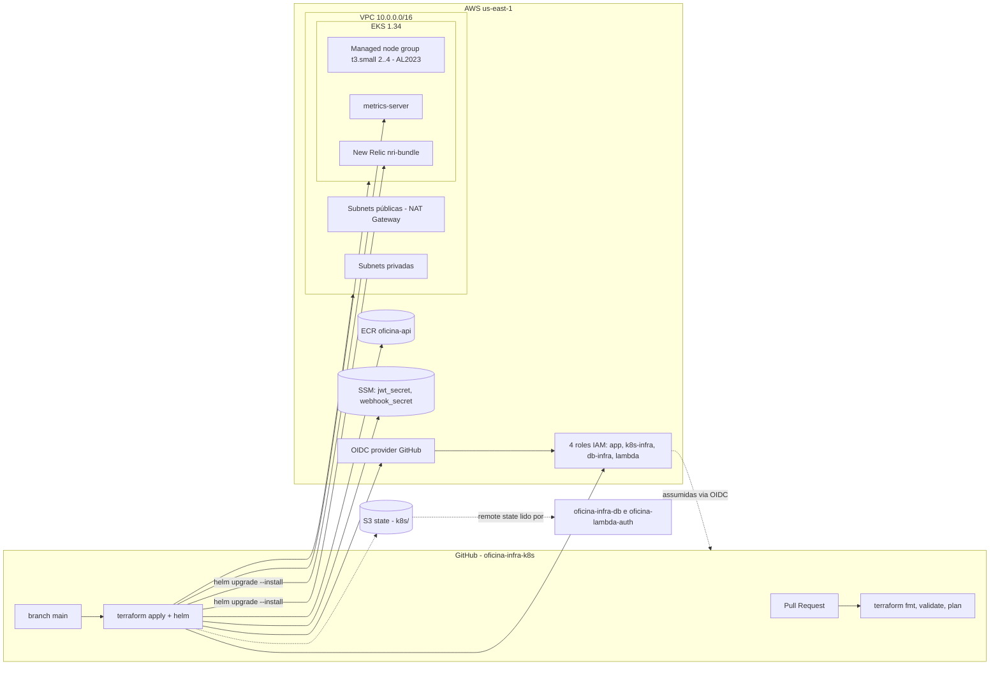

# oficina-infra-k8s — Infraestrutura Kubernetes (Terraform)

[](https://github.com/gaabriel165/oficina-infra-k8s/actions/workflows/terraform.yml)

Provisiona, com **Terraform**, a base de rede e computação onde a [oficina-api](https://github.com/gaabriel165/oficina-api) roda: VPC, cluster **Amazon EKS**, registro **ECR**, identidade **OIDC** para o GitHub Actions e os segredos compartilhados no **SSM Parameter Store**. É o primeiro dos três repositórios de infraestrutura a ser aplicado; os outros ([oficina-infra-db](https://github.com/gaabriel165/oficina-infra-db) e [oficina-lambda-auth](https://github.com/gaabriel165/oficina-lambda-auth)) leem o state deste via `terraform_remote_state`.

Parte do Tech Challenge da pós-graduação em Arquitetura de Software (FIAP SOAT) — Fase 3. Documentação completa da arquitetura: [`oficina-api/docs/architecture`](https://github.com/gaabriel165/oficina-api/tree/main/docs/architecture).

## Propósito

- Criar um cluster Kubernetes gerenciado com **escalabilidade** (managed node group 2..4 nós, HPA na aplicação).
- Isolar a aplicação e o banco em **subnets privadas**; só o load balancer fica em subnets públicas.
- Permitir que os quatro pipelines façam deploy **sem chaves estáticas** (GitHub OIDC → IAM roles).
- Gerar os segredos compartilhados entre a API e a Lambda de autenticação (`/oficina-api/jwt_secret`, `/oficina-api/webhook_secret`) uma única vez, no SSM.
- Instalar no cluster o `metrics-server` (pré-requisito do HPA) e a integração **New Relic** (`nri-bundle`: infra agent, kube-state-metrics, eventos e logs).

## Tecnologias

| Categoria | Tecnologias |
|---|---|
| IaC | Terraform ≥ 1.10, provider AWS 5.x, módulos oficiais `terraform-aws-modules` (vpc, eks, iam) |
| Nuvem | AWS us-east-1 — VPC, EKS 1.34 (AMI AL2023), EC2 t3.small, ECR, IAM OIDC, SSM Parameter Store |
| State | S3 `oficina-api-terraform-state-728750563430` (versionado, criptografado, lock nativo `use_lockfile`) |
| CI/CD | GitHub Actions — `fmt`/`validate`/`plan` no PR, `apply` no merge em `main`, `destroy` por `workflow_dispatch` |
| Cluster add-ons | metrics-server, New Relic `nri-bundle` via Helm |

## Arquitetura deste repositório



### Recursos criados

| Arquivo | Recursos |
|---|---|
| `vpc.tf` | VPC `10.0.0.0/16`, 2 AZs, 2 subnets públicas (tag `kubernetes.io/role/elb`) e 2 privadas, 1 NAT Gateway |
| `eks.tf` | Cluster EKS 1.34, node group `t3.small` (min 2 / max 4), access entries para os roles de CI |
| `ecr.tf` | Repositório `oficina-api` com scan de vulnerabilidades no push |
| `iam-github-oidc.tf` | Provider OIDC do GitHub + 4 roles: `oficina-api-app-github-actions` (ECR + describe EKS + leitura SSM), `oficina-api-k8s-infra-github-actions`, `oficina-api-db-infra-github-actions`, `oficina-api-lambda-github-actions` |
| `ssm.tf` | `random_password` → SSM SecureString `/oficina-api/jwt_secret` e `/oficina-api/webhook_secret` |
| `outputs.tf` | `vpc_id`, `private_subnet_ids`, `node_security_group_id`, `cluster_name`, `ecr_repository_url`, nomes dos parâmetros SSM e ARNs dos roles |

## Como executar

### Pré-requisitos

- AWS CLI autenticado (`aws sts get-caller-identity`), Terraform ≥ 1.10, kubectl, helm.
- Bucket de state já existente (criado uma vez): `oficina-api-terraform-state-728750563430`.

### Provisionar localmente

```bash
terraform init
terraform plan
terraform apply            # ~20 min (EKS)

# apontar kubectl para o cluster
eval "$(terraform output -raw configure_kubectl)"

# add-ons (o CD faz isso automaticamente)
kubectl apply -f https://github.com/kubernetes-sigs/metrics-server/releases/latest/download/components.yaml
helm repo add newrelic https://helm-charts.newrelic.com && helm repo update
helm upgrade --install newrelic-bundle newrelic/nri-bundle -n newrelic --create-namespace \
  --set global.licenseKey="$NEW_RELIC_LICENSE_KEY" --set global.cluster=oficina-api-eks \
  --set global.lowDataMode=true --set newrelic-infrastructure.privileged=true \
  --set kube-state-metrics.enabled=true --set kubeEvents.enabled=true \
  --set newrelic-logging.enabled=true --set nri-metadata-injection.enabled=true
```

### Deploy pelo pipeline

1. Abra um Pull Request → o workflow roda `fmt`, `validate` e comenta o `plan` no PR.
2. Merge em `main` → `terraform apply` automático, seguido da instalação do metrics-server e do New Relic.
3. `Actions → Terraform → Run workflow → destroy` remove tudo (apaga antes os Services `LoadBalancer` para o NLB não travar a VPC).

Configuração no GitHub (Settings → Secrets and variables → Actions):

| Tipo | Nome | Valor |
|---|---|---|
| Variable | `AWS_REGION` | `us-east-1` |
| Secret | `AWS_ROLE_ARN` | `arn:aws:iam::<conta>:role/oficina-api-k8s-infra-github-actions` (output `k8s_infra_github_actions_role_arn`) |
| Secret | `NEW_RELIC_LICENSE_KEY` | License key (INGEST) da conta New Relic — opcional; sem ela o passo é pulado |

> Bootstrap: o role que o próprio pipeline usa é criado por este Terraform. O primeiro `apply` é feito da máquina local; a partir daí o CD assume.

### Ordem entre os repositórios

```
oficina-infra-k8s  →  oficina-infra-db  →  oficina-api (CD)  →  oficina-lambda-auth
```

Destruição na ordem inversa. Antes de destruir este repositório, remova o Service `LoadBalancer` da aplicação:

```bash
kubectl delete svc oficina-api -n oficina-api --ignore-not-found
terraform destroy
```

## Regras do repositório

- Branch `main` protegida: sem commits diretos, merge só por Pull Request com o workflow verde.
- Nenhum segredo no código: senhas são geradas pelo `random_password` e vivem apenas no SSM e no state (S3 criptografado).

## Custo e disponibilidade

O ambiente é **provisionado sob demanda** para testes e para a gravação do vídeo e destruído em seguida (≈ US$ 0,50/h com EKS + 2 nós + RDS + NAT + NLB). Por isso os links de deploy podem estar fora do ar no momento da avaliação; o vídeo demonstra o pipeline e o ambiente em execução.

## Links

- Aplicação: [gaabriel165/oficina-api](https://github.com/gaabriel165/oficina-api) · Swagger (com o ambiente no ar): `https://<api-id>.execute-api.us-east-1.amazonaws.com/swagger/index.html`
- Banco: [gaabriel165/oficina-infra-db](https://github.com/gaabriel165/oficina-infra-db)
- Autenticação serverless + API Gateway: [gaabriel165/oficina-lambda-auth](https://github.com/gaabriel165/oficina-lambda-auth)
- Documentação de arquitetura (componentes, sequências, RFCs, ADRs, ER): [oficina-api/docs/architecture](https://github.com/gaabriel165/oficina-api/tree/main/docs/architecture)
